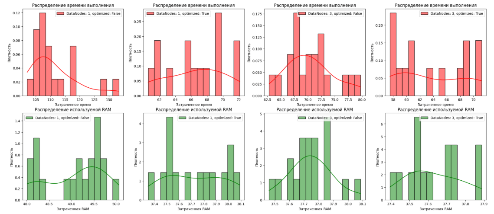

# Лабораторная работа #2

## Results:


## Среднее время/память при замерах

DataNodes: 1, optimized: False, average Time: 111.4

DataNodes: 1, optimized: False, average Memory consumtion: 49.0

DataNodes: 1, optimized: True, average Time: 66.5

DataNodes: 1, optimized: True, average Memory consumtion: 37.7

DataNodes: 3, optimized: False, average Time: 70.3

DataNodes: 3, optimized: False, average Memory consumtion: 37.7

DataNodes: 3, optimized: True, average Time: 63.7

DataNodes: 3, optimized: True, average Memory consumtion: 37.6


## Датасет:
https://www.kaggle.com/datasets/teejmahal20/airline-passenger-satisfaction

## Запуск:
Для запуска всех экспериментов
```bash
python run_all.py
```

